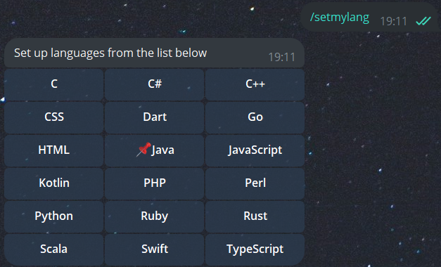
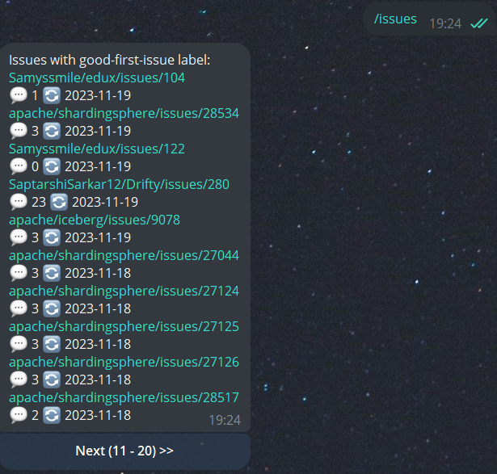
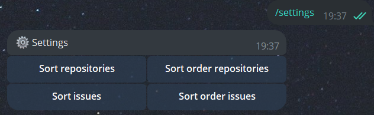

# Good first issue bot

[](https://github.com/agsamkin/goodfirstissue-bot/actions/workflows/build.yml)

[//]: # ([![Maintainability]&#40;https://api.codeclimate.com/v1/badges/3f81753ef428bf5a7464/maintainability&#41;]&#40;https://codeclimate.com/github/agsamkin/goodfirstissue-bot/maintainability&#41;)

[//]: # ([![Test Coverage]&#40;https://api.codeclimate.com/v1/badges/3f81753ef428bf5a7464/test_coverage&#41;]&#40;https://codeclimate.com/github/agsamkin/goodfirstissue-bot/test_coverage&#41;)

[@goodfirstissue_bot](https://t.me/goodfirstissue_bot) is a telegram bot that can help you in your "good first issue" search on GitHub.

The bot allows you to easily pick up your first good issues from popular open-source projects, and also helps you to make your first contributions as an open-source developer.

### How to use

1. To select your preferred language, enter the command /setmylang



2. To get a list of repositories, enter the command /repos


3. To get a list of issues, enter the command /issues



4. You can change order and direction of sorting repositories and tasks. To do this, enter the command /settings



### Development

Telegram:
* Create new telegram bot with [@BotFather](https://t.me/BotFather)
* Set env TG_BOT_USERNAME, TG_BOT_TOKEN

Webhooks:
* Install [ngrok](https://ngrok.com/download) if you use Windows or [localtunnel](https://theboroer.github.io/localtunnel-www/) if you use Linux distributive
* Get webhook with ngrok (or localtunnel)
* Set webhook with: 
```
https://api.telegram.org/bot{my_bot_token}/setWebhook?url={url_to_send_updates_to}
```

Install RabbitMQ with Docker:
```
docker pull rabbitmq:3.11.0-management
docker volume create rabbitmq_data
docker run -d --hostname rabbitmq --name rabbitmq -p 5672:5672 -p 15672:15672 -v rabbitmq_data:/var/lib/rabbitmq --restart=unless-stopped rabbitmq:3.11.0-management
```

GitHub:
* Create new [GitHub token](https://github.com/settings/tokens)
* Set env GITHUB_TOKEN